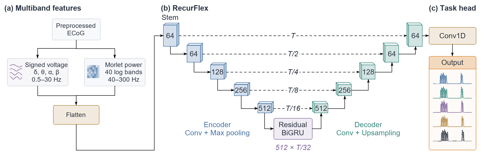
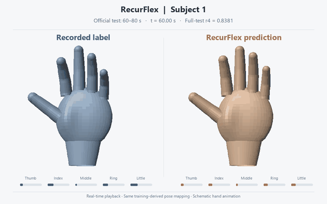
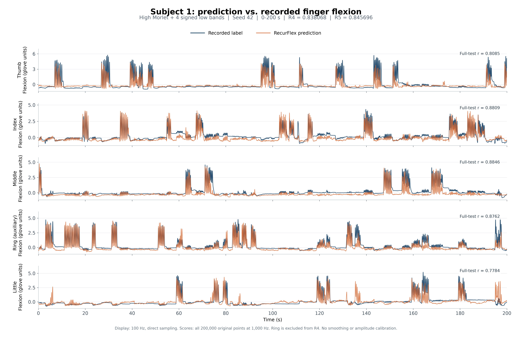
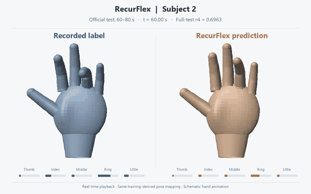
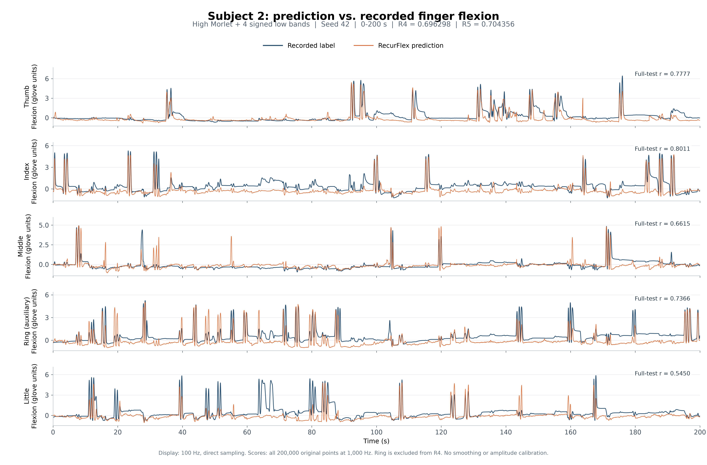
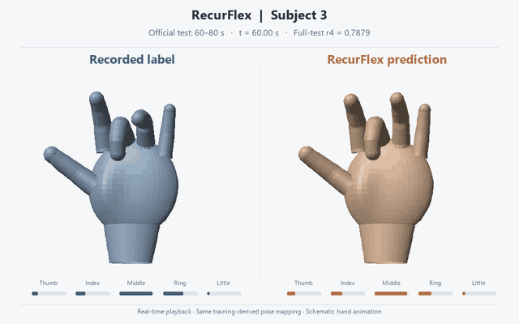
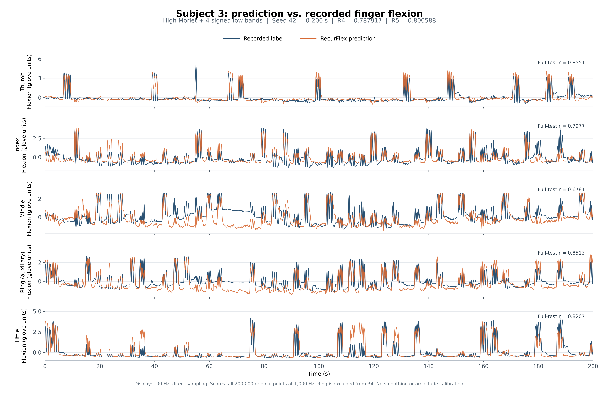
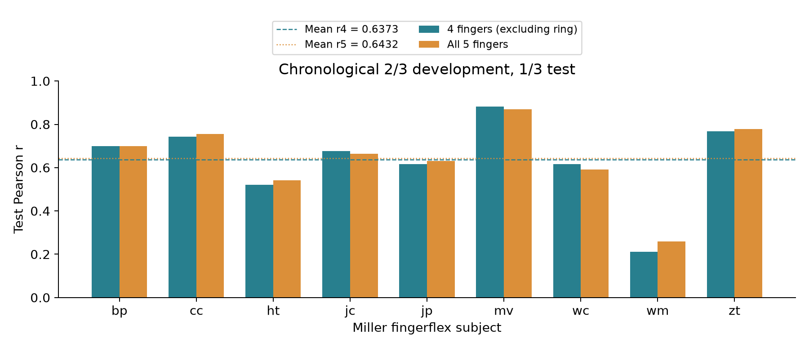

<h1 align="center">
  RecurFlex: Multiband Recurrent Decoding of Finger Trajectories from ECoG
</h1>

**Zhewen Guo** · Columbia University · [zg2567@columbia.edu](mailto:zg2567@columbia.edu)  
**Hongxun Peng** · Beihang University · [huxley329@buaa.edu.cn](mailto:huxley329@buaa.edu.cn)

RecurFlex reconstructs continuous finger trajectories from electrocorticography (ECoG). It combines high-frequency Morlet power with signed low-frequency voltage features, a temporal convolutional encoder–decoder, and a residual bidirectional GRU at the bottleneck.

RecurFlex delivers **SOTA**-level offline decoding performance on **BCI Competition IV Dataset 4**, evaluated using the official training/test split and four-finger Pearson-correlation scoring (**mean r = 0.7741**). The published-method comparisons below provide context; their differing evaluation protocols require care when interpreting rankings.

<p align="center">
  <a href="https://doi.org/10.5281/zenodo.23258246"><strong>Preprint · Zenodo DOI: 10.5281/zenodo.23258246</strong></a>
</p>

<p align="center">
  <a href="https://github.com/GA10d/RecurFlex/blob/main/paper/overleaf/main.tex">Manuscript source</a> ·
  <a href="https://github.com/GA10d/RecurFlex/blob/main/paper/code/Main%20Experiment">BCI implementation</a> ·
  <a href="https://github.com/GA10d/RecurFlex/blob/main/paper/result/main%20experiment%20average%20r/summary.json">BCI results</a> ·
  <a href="https://github.com/GA10d/RecurFlex/blob/main/paper/result/miller_fingerflex_9subjects_2of3/test_results.json">Nine-subject results</a> ·
  <a href="https://github.com/GA10d/RecurFlex/blob/main/paper/code/Ablation%20Experiment/frequency%20feature%20selection">Feature ablations</a>
</p>

## Model overview



- **Complementary features:** 40 log-spaced Morlet power bands at 40–300 Hz, plus signed delta (0.5–4 Hz), theta (4–8 Hz), alpha (8–13 Hz), and beta (13–30 Hz) voltage.
- **Temporal representation:** 16 training-selected electrodes × 44 features at 100 Hz; five encoder stages, symmetric skip connections, and a residual BiGRU bottleneck.
- **Continuous output:** five finger trajectories; 512-sample training windows and consecutive 2,048-sample inference blocks. Outputs are restored to glove units and interpolated to the original 1,000 Hz grid.

The model has **6,808,198 parameters**. Zero-phase filtering and bidirectional recurrence make this an **offline reconstruction** method.

## Results

### BCI Competition IV Dataset 4

Each subject uses the complete 400-second training recording and the complete 200-second official test recording. Pearson correlations are computed over every original test timestamp, averaged first across fingers and then equally across subjects.

| Subject | Official four-finger r | Five-finger r | Four-finger MAE | Four-finger MSE |
|:--|--:|--:|--:|--:|
| S1 | 0.838068 | 0.845696 | 0.368927 | 0.352761 |
| S2 | 0.696298 | 0.704356 | 0.521532 | 0.604666 |
| S3 | 0.787917 | 0.800588 | 0.397740 | 0.401945 |
| **Mean** | **0.774094** | **0.783547** | **0.429400** | **0.453124** |

The official four-finger metric includes the thumb, index, middle, and little fingers. The ring finger is predicted and shown as an auxiliary output. MAE and MSE use the original glove units.

### Comparison with reported methods

The following tables reproduce the comparison in the [preprint](https://doi.org/10.5281/zenodo.23258246) and [manuscript table](paper/overleaf/tables/literature_comparison.tex). **RecurFlex results are bold.** All values in these two comparison tables are **five-finger** Pearson correlations, including the auxiliary ring finger; the official four-finger BCI metric is reported separately above.

**BCI Dataset 4 — TRACE repository reports**

| Method | S1 | S2 | S3 | Mean |
|:--|--:|--:|--:|--:|
| FingerFlex | 0.575 | 0.520 | 0.692 | 0.597 |
| DTCNet | 0.696 | 0.598 | 0.747 | 0.680 |
| DeepFingerNet | 0.427 | 0.312 | 0.541 | 0.427 |
| TRACE | 0.776 | 0.622 | 0.773 | 0.724 |
| **RecurFlex (ours)** | **0.8457** | **0.7044** | **0.8006** | **0.7835** |

FingerFlex, DTCNet, and DeepFingerNet scores are the [TRACE authors' reimplementations](https://github.com/epyifany/TRACE/tree/5c7e47a469e266b472dfec82cf4adc379b25c23a); TRACE is their reported run. We evaluated RecurFlex independently. Source means are retained as reported. Checkpoint selection, target delay, smoothing, and scoring grids differ, so this is not a common-protocol ranking.

**Miller fingerflex — reported means under differing protocols**

| Method | Report / evaluation setting | Mean |
|:--|:--|--:|
| [FingerFlex](https://arxiv.org/abs/2211.01960v2) | Original paper | ≈0.49 |
| [HiLoFuseNet](https://github.com/hisunjiang/HiLoFuseNet/blob/bee83100953c85332e9ad24020345d8dad79a963/manuscript.pdf) | Updated manuscript | 0.558 |
| [CORTEG](https://arxiv.org/abs/2605.10337v1) | Pooled | 0.554 |
| [CORTEG](https://arxiv.org/abs/2605.10337v1) | Enhanced Base | 0.583 |
| FingerFlex | TRACE authors; 85/15 split | 0.436 |
| [TRACE](https://github.com/epyifany/TRACE/tree/5c7e47a469e266b472dfec82cf4adc379b25c23a) | 85/15 split | 0.508 |
| **RecurFlex (ours)** | **Two-thirds development / one-third test** | **0.6432** |

The Miller comparisons use different splits, training contexts, and target grids. RecurFlex has the highest reported mean among the rows shown, but the table does not establish superiority under identical evaluation conditions. The nine-subject extension is distinct from the official BCI evaluation described above.

### Prediction vs. recorded labels

**Blue: recorded label. Orange: RecurFlex prediction.** Every panel shows the full 0–200 s test recording, with no display smoothing, time shift, or amplitude calibration. Display samples are taken directly at 100 Hz; scores use all 200,000 original 1,000 Hz samples per subject.

**Paired hand animations:** left = recorded label, right = prediction. All three demos show the fixed **60–80 s** official-test interval at **real time**. Both hands use the same training-derived glove-to-flexion mapping; poses are schematic, with no prediction smoothing or time shift. Click each animation to open its MP4. Full-test trajectories are retained below. [Video generation and provenance](assets/videos/README.md).

#### Subject 1 · four-finger r = 0.8381

[](assets/videos/s1_hand_comparison.mp4)

[▶ Watch Subject 1 MP4 · 20 s · real time](assets/videos/s1_hand_comparison.mp4)



#### Subject 2 · four-finger r = 0.6963

[](assets/videos/s2_hand_comparison.mp4)

[▶ Watch Subject 2 MP4 · 20 s · real time](assets/videos/s2_hand_comparison.mp4)



#### Subject 3 · four-finger r = 0.7879

[](assets/videos/s3_hand_comparison.mp4)

[▶ Watch Subject 3 MP4 · 20 s · real time](assets/videos/s3_hand_comparison.mp4)



### Miller fingerflex: nine-subject extension

| Evaluation | Subjects | Split | Four-finger r | Five-finger r |
|:--|--:|:--|--:|--:|
| Miller fingerflex | 9 | First 2/3 development; final 1/3 test, with a 2 s gap | 0.637346 | **0.643181** |



All nine models were initialized and trained separately with seed 42. Electrode selection, feature scaling, and target ranges use the corresponding training segment. The primary metric for this extension is the five-finger mean.

**Interpretation.** BCI Dataset 4 originates from the Miller fingerflex collection, so these evaluations have overlapping source cohorts. The nine-subject experiment uses a custom chronological split, not an official competition split. Published baselines differ in their splits, target delays, smoothing, and scoring grids; this release does not establish common-protocol superiority over all published methods. Earlier method exploration inspected the public BCI test, and the reported results are single-seed results. See the [manuscript discussion](paper/overleaf/sections/04_results.tex).

## Reproduce the BCI results

Use Python 3.11/3.12. The repository includes the three trained BCI checkpoints and scaling statistics. Obtain the original dataset and test labels separately and place them in:

```text
paper/data/BCICIV_4_mat/
├── sub1_comp.mat
├── sub2_comp.mat
├── sub3_comp.mat
├── sub1_testlabels.mat
├── sub2_testlabels.mat
└── sub3_testlabels.mat
```

The competition files contain `train_data`, `train_dg`, and `test_data`; label files contain `test_dg`. Raw recordings and test labels are not distributed in this repository.

```bash
cd "paper/code/Main Experiment"
python -m pip install -r requirements.txt
python main.py --stage test --device cuda
```

Use `--device cpu` for CPU execution, or `--data-dir /path/to/data --labels-dir /path/to/labels` for external data locations. Predictions are saved before evaluation reads test labels. Outputs appear in `runs/main/predictions/` and `runs/main/results/`.

```bash

# Train fresh models with the published subject-specific budgets, then evaluate.
python main.py --stage all --run-dir runs/retrained42 --device cuda

# Run the implementation's model/checkpoint verification.
python verify.py --device cpu
```

The included checkpoints were trained for 112, 69, and 104 epochs for S1, S2, and S3. The reported scores were obtained by rerunning full inference with those completed checkpoints, rather than by repeating full training during packaging. Platform-dependent numerical differences are possible.

For the nine-subject experiment, [the source and frozen protocol](paper/code/Miller%20Experiment%202of3/code) document the original preparation, training, and scoring pipeline. It requires separately obtained Miller recordings and experiment input preparation; the BCI quick-start command does not run this experiment. Nine-subject checkpoints are not included.

## Repository contents

```text
assets/                       Architecture and README result figures
paper/code/Main Experiment/   BCI preprocessing, model, training, inference, checkpoints
paper/code/Miller Experiment 2of3/code/
                              Nine-subject experiment source and frozen protocol
paper/result/                 Saved scores, prediction files, and plotting source
paper/overleaf/               IEEE-format LaTeX manuscript source
```

The paper source can be uploaded to Overleaf with `main.tex` as the entry point and pdfLaTeX as the compiler.

## Citation

The manuscript is available as a [Zenodo preprint](https://doi.org/10.5281/zenodo.23258246). Please cite the preprint:

```bibtex
@misc{guo_recurflex_2026,
  author = {Guo, Zhewen and Peng, Hongxun},
  title = {RecurFlex: Multiband Recurrent Decoding of Finger Trajectories from ECoG},
  year = {2026},
  publisher = {Zenodo},
  doi = {10.5281/zenodo.23258246},
  url = {https://doi.org/10.5281/zenodo.23258246}
}
```

## Contact

Questions about the manuscript and experiments: [Zhewen Guo](mailto:zg2567@columbia.edu) and [Hongxun Peng](mailto:huxley329@buaa.edu.cn).
